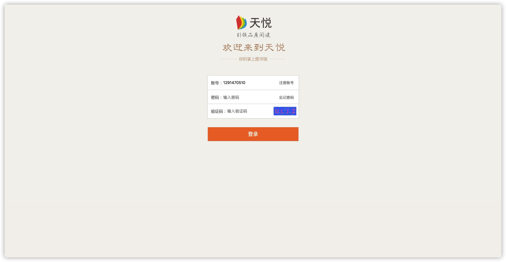
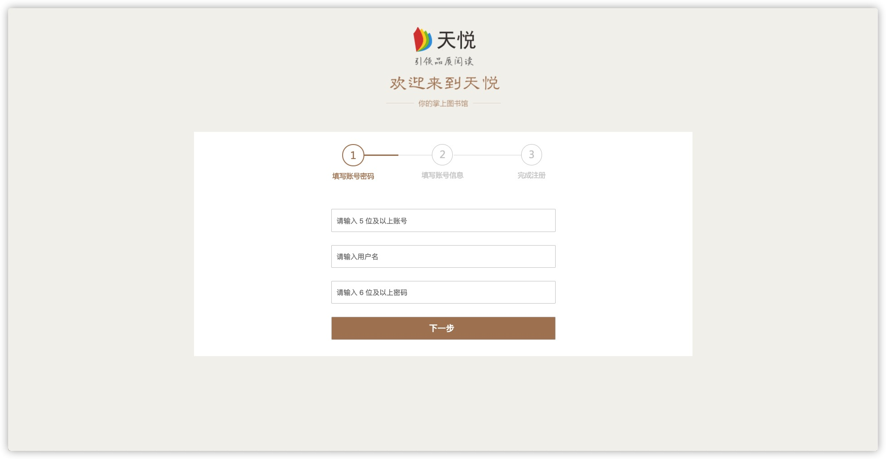
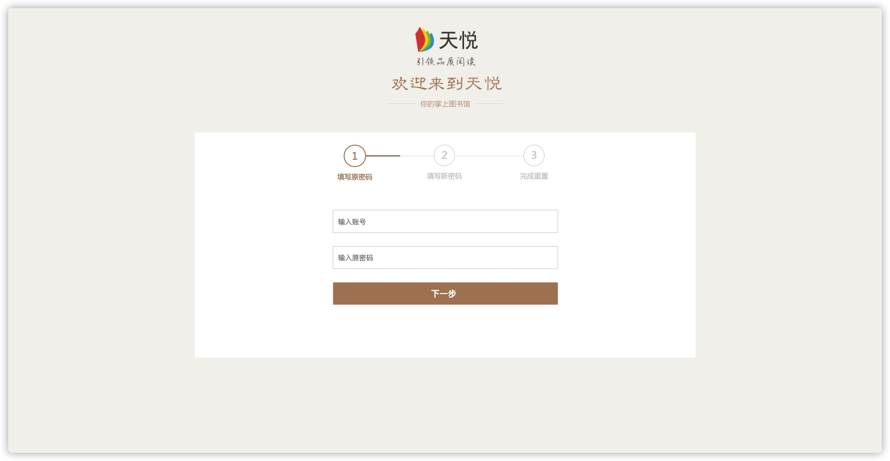

# TianYue

## Beta 0.1
- 目前用了浏览器的 session 和 cookie 在登录成功之后保存账号，有效期为两周
- 用到的知识：`django，mysql，mvt(model, view(controller),template，javascript，javascript ajax请求，html，css，python，python爬虫，验证码用的 python 的 pillow 库，每次网页刷新随机生成验证码图片`
- 验证码用的 `cookie` 传递正确值
- 平台：Mac，编辑器：[neovim](https://neovim.io/)

### 功能
- 搜索图书功能 
- index 页面展示图书
- 通过邮箱验证码修改密码
- 图书评论功能
- 用户个人信息修改
- 用户图书阅读记录
- 用户个人信息界面展示评论记录

## 页面
### 登录页面

### 注册页面

### 重置密码页面

### 静态文件
- javascript, css, 图片 在 static 文件夹

## 数据来源

### 图书数据
- 图书数据用项目根目录的 get_book.py 在网站上爬取，因为感觉一个一个写太麻烦，就自己写了一个爬虫
### 用户数据
- 用户的数据是用根目录的 spawn_user.py 生成，原因和图书数据一样
